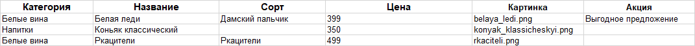

# Сайт магазина авторского вина "Новое русское вино".

Этот проект представляет собой простой веб-сервер, 
который отображает HTML-страницу с информацией о винах, 
загружаемой из Excel-файла. Данные организованы по категориям вин, 
также отображается минимальная цена для каждой категории. 
В проекте используется `Jinja2` для HTML-шаблонов и `http.server` для локального хостинга страницы


## Функциональные возможности
- Загружает данные о винах из Excel-файла.
- Организует вина по категориям.
- Отображает минимальную цену и акции вин.
- Показывает количество лет с момента основания винного магазина.
- Выводит HTML-страницу на локальном сервере.


## Требования

- Python 3.x
- Необходимые библиотеки Python (можно установить через pip):
  - `pandas`
  - `jinja2`

## Инструкции по установке

1. Склонируйте репозиторий или загрузите файлы проекта.


2. Установите необходимые зависимости:
```
pip install -r requirements.txt
```
3. Добавьте Excel-файл данных формата `xlsx` , как показано на рисунке, в папку с проектом:


> Для изменения даты основания отредактируйте значение в `main.py`, где используется переменная `created_winery`.


## Запустите сервер

- Через командную строку командой `cd` перейдите в папку проекта
- Запустите скрипт командой:
```
python main.py [название файла].xlsx
```
- Откройте браузер и перейдите по адресу http://0.0.0.0:8000, чтобы увидеть сгенерированную страницу